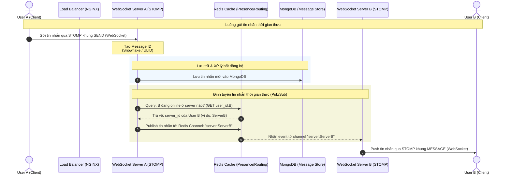

# Mini Messenger

Ứng dụng nhắn tin thời gian thực kích thước nhỏ (Mini Real-time Messaging Web Application) được xây dựng trên mô hình kiến trúc phân tán microservices/scalable backend, tối ưu hóa cho khả năng mở rộng (scalability), độ trễ thấp (low latency) và tính nhất quán của dữ liệu.

---

## 📌 Kiến Trúc Hệ Thống (Architecture Overview)

Dưới đây là mô hình định tuyến tin nhắn và luồng dữ liệu thời gian thực giữa hai người dùng (User A và User B) khi kết nối tới các WebSocket server khác nhau qua giao thức STOMP.

---

## 🛠️ Công Nghệ Sử Dụng (Technology Stack)

| Thành phần         | Công nghệ                         | Vai trò & Lý do lựa chọn                                                                                                                    |
| :----------------- | :-------------------------------- | :------------------------------------------------------------------------------------------------------------------------------------------ |
| **Frontend**       | **Nuxt** (Vue.js Framework)       | Rendering giao diện phía client (SSR/SPA), tối ưu SEO và tốc độ tải trang ban đầu.                                                          |
| **Backend**        | **SpringBoot** (Java)             | Đảm bảo tính ổn định, xử lý logic nghiệp vụ mạnh mẽ và hỗ trợ WebSocket STOMP tự nhiên.                                                     |
| **Networking**     | **Standard WebSocket + STOMP**    | Giao thức nhắn tin thời gian thực nhẹ, hướng đối tượng (Message-oriented) với cấu trúc khung (frame) rõ ràng (CONNECT, SEND, SUBSCRIBE...). |
| **Load Balancing** | **NGINX** (IP Hash + Round Robin) | Điều phối tải trọng và giữ kết nối WebSocket (Sticky Sessions qua IP Hash).                                                                 |
| **Databases**      | **PostgreSQL** & **MongoDB**      | **PostgreSQL**: Dữ liệu quan hệ (User, Friendships).  **MongoDB**: Lưu trữ tin nhắn phi cấu trúc, ghi nhanh.                             |
| **Storage / CDN**  | **MinIO** (Object Storage) + CDN  | Lưu trữ tập tin đa phương tiện (ảnh, video, files) và tối ưu hóa tốc độ phân phối qua CDN.                                                  |
| **Message Broker** | **Redis Pub/Sub**                 | Định tuyến tin nhắn tức thời và phát tán sự kiện giữa các WebSocket server node.                                                            |
| **Cache**          | **Redis**                         | Tăng tốc độ truy xuất, quản lý trạng thái hiện diện và bảng định tuyến kết nối.                                                             |
| **Container**      | **Docker & Docker Compose**       | Nhất quán môi trường phát triển, đóng gói và triển khai dễ dàng.                                                                            |

---

## 💾 Chiến Lược Caching & Cấu Trúc Dữ Liệu Redis

Hệ thống sử dụng **Redis** với các cấu hình chiến lược và kiểu dữ liệu (data structures) tối ưu cho từng tác vụ:

### 1. Chiến lược Caching

- **Write-through**: Áp dụng đối với **Trạng thái tin nhắn** (Delivered, Read, Sent) để đảm bảo client nhận được cập nhật trạng thái phản hồi ngay lập tức, sau đó đồng bộ ghi xuống DB chính.
- **Cache-Aside**: Áp dụng đối với **Danh sách bạn bè**. Server đọc từ Cache trước, nếu thiếu (Cache Miss) sẽ truy vấn PostgreSQL và cập nhật lại vào Cache.
- **Cache Eviction**: Sử dụng chính sách **LRU (Least Recently Used)** để tự động giải phóng bộ nhớ khi đầy, ưu tiên xóa dữ liệu các cuộc hội thoại (conversations) hoặc người dùng ít hoạt động nhất.

### 2. Cấu trúc dữ liệu Redis (Redis Data Structures)

- **User Presence (Trạng thái hoạt động)**:
  - Sử dụng Redis **String** hoặc **Hash** để lưu trạng thái `online` / `offline` + `last_seen` (thời gian hoạt động cuối).
  - Đi kèm với cấu hình **TTL (Time To Live)** để tự động chuyển thành `offline` nếu client mất kết nối đột ngột mà không kịp gửi tín hiệu báo đóng.
- **Message Routing Table (Bảng định tuyến tin nhắn)**:
  - Sử dụng Redis **Hash** dạng `user_id` -> `server_id` để nhanh chóng tra cứu vị trí kết nối WebSocket hiện tại của một người dùng bất kỳ.

---

## 📐 Thuật Toán Bổ Trợ Quan Trọng

### 1. Tạo ID Tin Nhắn (Message ID Generation)

Để đảm bảo tin nhắn được đồng bộ nhất quán trên toàn bộ các cụm server mà không phụ thuộc vào khóa tự tăng (Auto-increment) của cơ sở dữ liệu:

- Hệ thống áp dụng thuật toán **Snowflake (Twitter Snowflake)** để sinh ID dạng **64-bit**.
- Các ID được tạo ra đảm bảo:
  - **Duy nhất (Unique)** trên toàn hệ thống phân tán.
  - **Sắp xếp theo thời gian (Time-sortable)** giúp client dễ dàng sắp xếp thứ tự hiển thị tin nhắn dựa vào ID mà không cần so sánh timestamp chi tiết.

### 2. Luồng Định Tuyến Tin Nhắn (Message Routing Flow)

Khi **User A** gửi tin nhắn cho **User B**:

1. **Server A** nhận tin nhắn từ User A qua kết nối WebSocket (STOMP frame `SEND`).
2. Server A tạo Unique ID cho tin nhắn đó và lưu trữ vào **MongoDB**.
3. Server A truy vấn Redis (`Message Routing Table`) tìm xem **User B** đang kết nối tới `server_id` nào.
4. Server A publish nội dung tin nhắn kèm metadata vào channel Redis tương ứng với server tìm được (ví dụ channel: `server:ServerB`).
5. **Server B** (đăng ký subscribe channel trên) nhận được event từ Redis -> Push trực tiếp tới thiết bị của **User B** qua kết nối WebSocket (STOMP frame `MESSAGE`).

---

## 🐳 Triển Khai & Vận Hành (Deployment)

Hệ thống được đóng gói hoàn toàn trong các Docker containers và quản lý thông qua **Docker Compose**:

- **NGINX**: Cấu hình cơ chế cân bằng tải phối hợp:
  - **IP Hash**: Giữ kết nối WebSocket của cùng một client luôn đi tới cùng một server node để duy trì session ổn định.
  - **Round Robin**: Dành cho các API HTTP thông thường (Login, Register, profile...).
- Các service phụ trợ như PostgreSQL, MongoDB, Redis, MinIO được cấu hình mạng nội bộ (`internal network`) biệt lập để nâng cao tính bảo mật.
